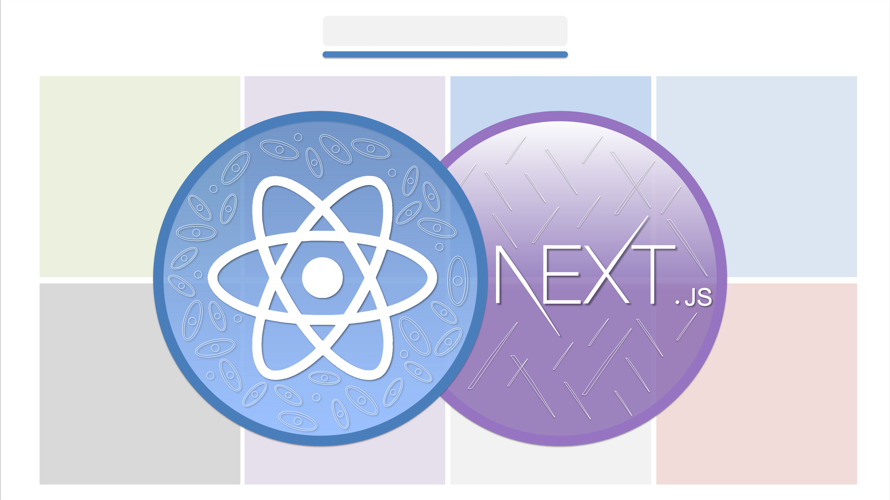

## Course Repository for Next.js and React 18 Course by David Jospeph Katz

**[https://www.udemy.com/course/nextjs-and-react-bootcamp](https://www.udemy.com/course/nextjs-and-react-bootcamp/?referralCode=686A52209BC6FC20C7B7)**

In this course, you will learn:

* The Next.js React Framework and React 18
* Client vs. Server Components and Client-Side vs. Server-Side Rendering
* New React 18 hooks: useTransition and useDeferredValue
* React Suspense
* The Next.js Architecture: Layouts, Pages, and Routes
* Next.js Dynamic Segments and Route Groups
* Next.js hooks like usePathname and useSelectedLayoutSegments
* Next.js Deployment with Vercel
* Tailwind CSS
* And more

### Links
1. [sandbox/davidkandomusic-demo-starting-point](https://codesandbox.io/p/sandbox/davidkandomusic-demo-starting-point-h7p5g9)
2. [davidkandomusic.com](https://www.davidkandomusic.com)
3. [davidkandomusic repo](https://github.com/15Dkatz/davidkandomusic)

### Commits/Code Per Lecture
* [Start the Next.js and React Project](https://github.com/15Dkatz/next-react-course/commit/0a8efe7a8d4f5594b1f2289e2ca639cbdd080062)
* [Link to Pages with Next/Link | Grid Item](https://github.com/15Dkatz/next-react-course/commit/e6c0d214df81259e573f3adb0a7866711fdc9b70)
* [Style with Tailwind CSS | Styling](https://github.com/15Dkatz/next-react-course/commit/e91dcb064264fb6a1ffe2234962666d8d3d2db89)
* [Next.js Fonts and Responsive Design](https://github.com/15Dkatz/next-react-course/commit/4efd1b4fd7cbed5d3edd3850bd8b99705c84c5a3)
* [Connect Page Setup](https://github.com/15Dkatz/next-react-course/commit/9d7a5a4c9903f81cd790a85504d0704c0ead3e4c)
* [Next.js Client Components](https://github.com/15Dkatz/next-react-course/commit/714bf1a574213b612d79ddc80c47ebd9d9be8b2c)
* [Next.js Server Actions (get-followers)](https://github.com/15Dkatz/next-react-course/commit/e5c1767f20b1accbc835393ea2e105832e3ee5e6)
* [Mailjet API post-contact Server Action and Next.js Environment Variables](https://github.com/15Dkatz/next-react-course/commit/15f78aab5892dbcbe0024160a393a4d80f2b72e1)
* [React 18 useTransition and Create Contact Form](https://github.com/15Dkatz/next-react-course/commit/d689d276f15ae9cab4a6edb83bee6154f33ecdc8)
* [Next.js Layout Structure, Loading.js, and Global Components](https://github.com/15Dkatz/next-react-course/commit/3b7240918b374a53ed244a4b55e86fa4d220cc4b)
* [Next.js Dynamic Segments and generateStaticParams | record/\[id\]](https://github.com/15Dkatz/next-react-course/commit/0fda239ac665576126863ada4b13662b4492468a)
* [Next.js generateMetadata | record/\[id\]/page.js](https://github.com/15Dkatz/next-react-course/commit/0aa48b523425abae083e4ceb789604a00b22f6fc)
* [React Suspense and React lazy | Embed](https://github.com/15Dkatz/next-react-course/commit/609ec6afede027c15cb840261bb47d20e4515738)
* [Next.js not-found and Route Groups](https://github.com/15Dkatz/next-react-course/commit/56f6000bdd5a936150bea15c1b08ab21dcddaa44)
* [Nested Dynamic Segments | record/\[id\]/\[content\]](https://github.com/15Dkatz/next-react-course/commit/9c7f3a26397714e811b1b53a93017c2c9251646e)
* [Breadcrumbs Component and Next.js useSelectedLayoutSegments | nav-title](https://github.com/15Dkatz/next-react-course/commit/1e7870ecdcc7ceaaa97fd95091a938a55c7527cd)
* [Setup Quiz Form and (form) route group](https://github.com/15Dkatz/next-react-course/commit/27fb95097796fba2dbd74338099f6ce9947d8da0)
* [Next.js useSearchParams and Quiz result](https://github.com/15Dkatz/next-react-course/commit/13648fecb2bc3b681aec05d5f5febda295dfbedd)
* [Next.js Images and Web Standards | Discography](https://github.com/15Dkatz/next-react-course/commit/dc4aa96c3687fd646f86035d44519ad1570d4ff8)
* [React 18 useDeferredValue](https://github.com/15Dkatz/next-react-course/commit/5c57464030f610c2033090d28d2095f667eef4fb)
